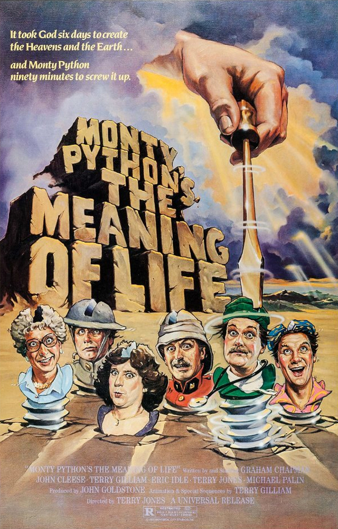
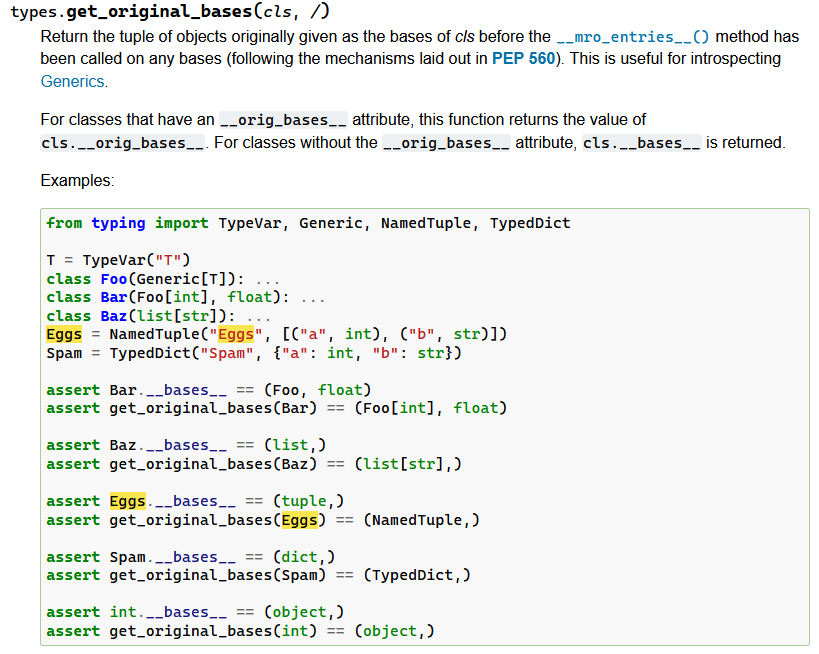
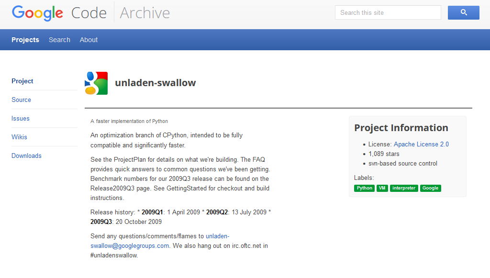
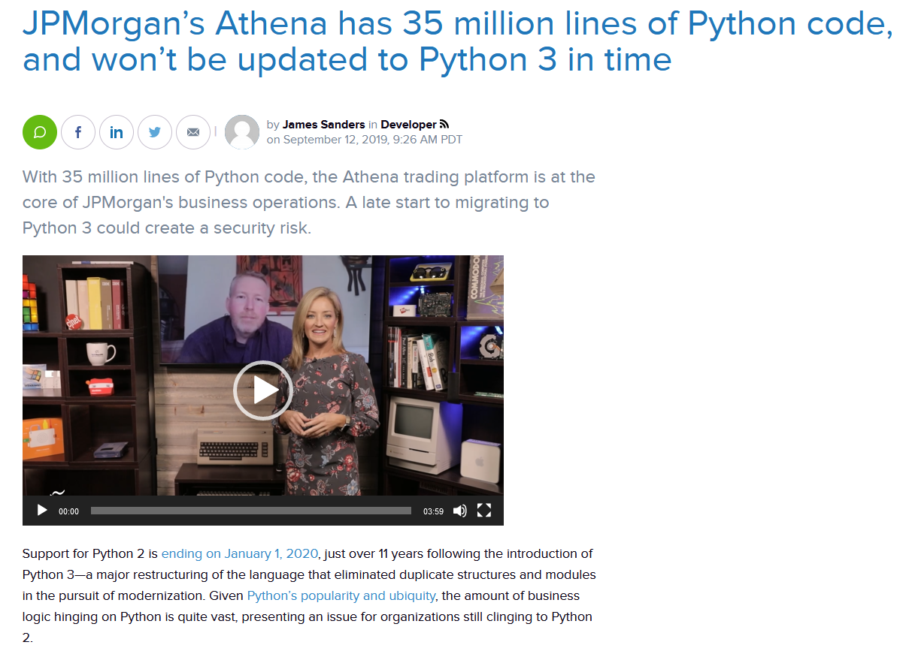
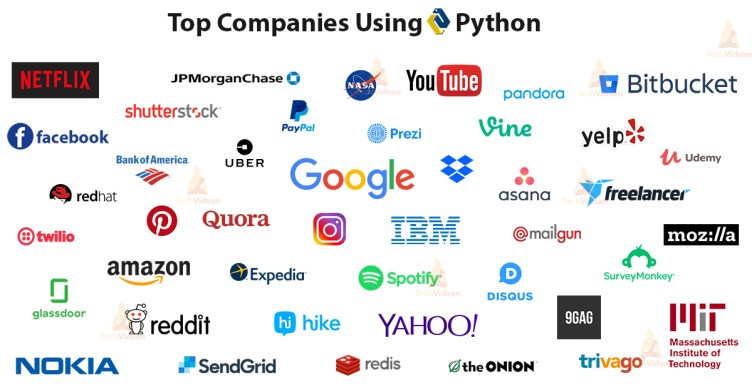
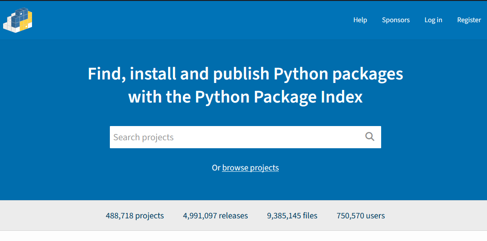

## Python Essentials for Technology Professionals


Presented Online for Trade Me

By Simon Merrick
2023-10-25

---

##  Who is this course for?
<p>Technology professionals looking to transition to or upskill in Python</p>

---

## Assumptions
<ul>
    <li>Basic understanding of fundamental programming concepts and constructs</li>
    <li>Ability to google / find documentation for details of specific</li>
    <li>Basic knowledge of command line usage</li>
    <li>Familiarity with basic concepts of object-oriented programming</li>
    <li>Willingness to experiment and explore with the language</li>
</ul>

---

## Goals

Write better python code with more confidence

Unknown Unknowns ➡️ Known Knowns

---

## Goals

or, at the very least

Unknown Unknowns ➡️ Known Unknowns

---

## What will we cover

 - Python language features
 - Writing "pythonic" code (E.g. idioms and best practices)
 - Python ecosystem (environment and dependency management)
 - Quirks and Gotchas!
 - Where to find help

---

## What this course is not
<ul>
    <li>An introduction to programming fundamentals for beginners</li>
    <li>A deep dive into data structures and algorithms</li>
    <li>A course on a specific application of Python (like web development or data science)</li>
</ul>

---

## Who am I

Simon Merrick

Cloud Engineer -- Payments

---

## Who am I

 - 10 years of academic and professional Python experience
 - Python NZ former Secretary and nominated committee member
 - Volunteer/Organising team for KiwiPycon 2019, 2022, 2023, 2024

---

# Python


---

# 1991

Python first released to public as version 0.9.0

---


Guido Van Rossum

a.k.a our BDFL

(Benevolant Dictator for Life)

---

# 🐍⛔

---




---




---




---

## Python 2

2000 - 2015 🪦

---

## Python 3

2008 - Present

---

## Semver

<p>MAJOR.Minor.patch</p>

---

## Semver

<p>2.x ➡️ 😭😭 ➡️ 3.x</p>

---




---

## Python 2


2000 - <s>2015</s> 🪦

2000 - 2020 🪦🪦

---


<p><a>https://devguide.python.org/versions/</a></p>

---

## Python 4

...probably not

---




---

Data Science

Scientific Computing

Machine Learning/Artificial Intelligence

Web Development

+ More

---


<p>TIOBE Index "Programming Language of the Year"</p>
<p>2021, 2020, 2018, 2010, 2007</p>
<p>🏆🏆🏆</p>
<p>Currently #1 for 2023</p>
<p><a>https://www.tiobe.com/tiobe-index/</a></p>

---

Widely adopted by professionals who's primary job is \*\*not\*\* full time programming

---

## Why Python?

Easy, Powerful, Flexible, Extensible

---

<p>Relevant XKCD (<a href="https://xkcd.com/353/">#353</a>)</p>


---

Specifically designed to be easily <s>written</s> <i><b>read</b></i>

---

## "Pythonic"

adjective

"An approach to computer programming that agrees with the founding philosophy of the Python programming language."

---

<p>Easter Egg</p>

```python
>>> import this
```

```plaintext
The Zen of Python, by Tim Peters

Beautiful is better than ugly.
Explicit is better than implicit.
Simple is better than complex.
Complex is better than complicated.
Flat is better than nested.
Sparse is better than dense.
Readability counts.
[...]
```

<p>PEP 20: The Zen of Python</p>
</p><a
    href="https://peps.python.org/pep-0020/#the-zen-of-python">https://peps.python.org/pep-0020/#the-zen-of-python</a>
</p>

---


"Batteries Included"

200+ modules in the standard library

<a>https://docs.python.org/3/library/index.html</a>

---

|||
|---|---|
|json, csv, and xml|parsing and manipulating JSON, CSV, and XML data.|
|venv|Python virtual environment Management|
|argparse|CLI Argument Parser|
|unittest|Unittesting framework|
|sqlite3|Native support for SQLite|
|logging|a flexible framework for emitting log messages|

---

PyPI (<b>Py</b>thon <b>P</b>ackage <b>I</b>ndex)
<br>
<a>https://pypi.org/</a>

---

|||
|---|---|
|Data Science|Pandas|
|Scientific Computing|NumPy, SciPy, PyPlot|
|Machine/AI|PyTorch, TensorFlow|
|Web Development|Django, Flask, FastAPI|

+480,000 more packages in PyPI

---

## Python Performance

"Python is slow"

---

## Python Performance

<br>

---

Python Performance
<p>NumPy, PyTorch, TensorFlow</p>

---

Python as a 'Glue' Language

---

https://python.nz/
https://groups.google.com/g/nzpug
