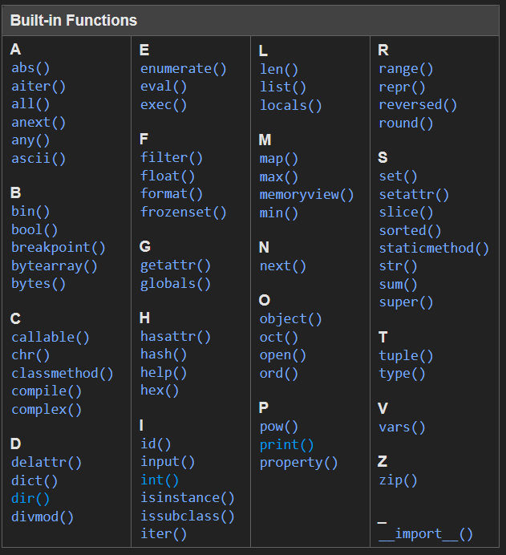

## Orientating Ourselves in python

---

### Python is Strongly typed

Variables do have a type and that the type matters when performing operations on a variable.

---

|Loosely Typed|Strongly Typed|
|---|---|
|Perl|**Python**|
|JavaScript|TypeScript|
|shell|Java|
|PHP|C#|

---

Some Basic Python Types

|||
|---|---|
|``str``|``"This is a string literal"``|
|``int``|``10``, ``0xA``, ``0O12``, ``0b1010``|
|``float``|``3.14159265358``|
|``complex``|``3 + 2j``|

https://docs.python.org/3/library/stdtypes.html

---

```python
1 + 2        # 3
1 + "2"      # TypeError: unsupported operand type(s) for +: 'int' and 'str'
```

---

### Python is dynamically typed

* Explicit type declarations are not requried
* Type checking is completed during run time
* The type of a variable can change

---

|Dynamically Typed|Statically Typed|
|---|---|
|**Python**|Go|
|Javascript|TypeScript|
|Perl|C#|
|PHP|Java|

---

Python is Dynamically Typed

```python
foo = "this is a string"
type(foo) # <class 'str'>

foo = 9000
type(foo) # <class 'int'>
```

---

```python
def greeting(name):
    return 'Hello ' + name

greeting(1)
```

---

```python
def greeting(name):
    return 'Hello ' + name

greeting(1)
# Traceback (most recent call last):
#   File "<stdin>", line 1, in <module>
#   File "<stdin>", line 2, in greeting
# TypeError: can only concatenate str (not "int") to str
```

---

"Strong ***testing*** not strong ***typing***"

---

### Spoiler: Type Hinting

```python
def greeting(name: str) -> str:
    return 'Hello ' + name
```

https://docs.python.org/3/library/typing.html

---

Builtin functions



https://docs.python.org/3/library/functions.html

---

Builtin functions

Already seen:

```python
type(), print()
```

We'll visit more of these as we go

```python
dir(), help(), len(), range(), enumerate(), zip(), # + More
```

https://docs.python.org/3/library/functions.html


---

<!-- In Python everything is an object, even functions
<br>
<br> -->

``type()`` tells us the type of an object
<br>
<br>

```python
foo = "this is a string"
type(foo)      # <class 'str'>

bar = 10
type(bar)      # <class 'int'>
```
<!-- <br>
All things in python have a set of both *attributes* and *behaviours* assoicated with them -->

---

We can get help information for an object with ``help()``
<br>
```python
help(str)
```

```plaintext
Help on class str in module builtins:

class str(object)
 |  str(object='') -> str
 |  str(bytes_or_buffer[, encoding[, errors]]) -> str
 |  
 |  Create a new string object from the given object. If encoding or
 |  errors is specified, then the object must expose a data buffer
 |  that will be decoded using the given encoding and error handler.
 |  Otherwise, returns the result of object.__str__() (if defined)
 |  or repr(object).
```

---

We can list all *properties* and *methods* of an object using ``dir()``

```python
foo = "this is my string"
dir(foo)
# ['__add__', '__class__', '__contains__', '__dir__','[...]', '__str__', 'capitalize', 'count', 'endswith', 'expandtabs', 'find', 'format', 'format_map', 'index', 'isalnum', 'isalpha', 'isascii', 'isdecimal', 'isdigit', 'isidentifier', 'islower', 'isnumeric', 'isprintable', 'isspace', 'istitle', 'isupper', 'join', 'ljust', 'lower', 'replace', 'split', 'splitlines', 'startswith', 'strip', 'swapcase', 'title', 'translate', 'upper',]
```

<!-- 
"Dunder methods" or "Magic methods"
<br><br>
```
__add__', '__class__', '__contains__', '__delattr__', '__dir__', '__doc__', '__eq__'
```
<br>
We will come back to these and even write our own -->

---

More Python Types

|||
|---|---|
|``bool``|'``True``' or '``False``'|
|``None``| Equivalent to '``null``' or '``nil``' in other languages |

https://docs.python.org/3/library/stdtypes.html

---

Comparison

|||
|---|---|
|Equality| ``a == b`` |
|Inequality| ``a != b `` |
|Greater than| ``a >= b`` |
|Less than | ``a <= b``|

https://docs.python.org/3/library/stdtypes.html#comparisons

---

Integer Arithmatic

|||
|---|---|
|Additiona and Subtraction| ``a + b``, ``a - b``|
|Multiplcation and Division| ``a * b``, ``a / b`` |
|Exponentiation| ``a ** b`` |
|Floor division | ``a // b `` |

https://docs.python.org/3/library/stdtypes.html#numeric-types-int-float-complex

---

String concatenation

```
"what a wonderful" + " " +  "day"
```

---

Common string methods

``upper()`` and ``lower()``
```python
"foo".upper()   # "FOO"
```

strip(), lstrip(), and rstrip()

```python
"foo   ".strip()   #  "foo"
"foo".strip("o")   #  "f"
```

---

``split()`` and ``join()``
 
```python
"foo".split()   #  ['f', 'o', 'o']
```

The opposite of ``split`` is not this

```python
['f', 'o', 'o'].join("")
# AttributeError: 'list' object has no attribute 'join'
```

---

The opposite of ``split``

```python
"foo".split()   #  ['f', 'o', 'o']
```

is this

```python
"".join(['f', 'o', 'o'])    #  "foo"
```

---


Built In Collection Types

|||
|---|---|
|``list``|``[1, 2, 3]``|
|``tuple``|``(1, 2, 3)``|
|``set``|``{1, 2, 3}``|
|``dict``|``{"a": 1, "b":2, "c": 3}``|

---

list methods


``append()`` and ``pop()``

```python
my_list = [1, 2, 3]
```

```python
my_list.append(4)
```

```python
my_list.append(pop())
```

