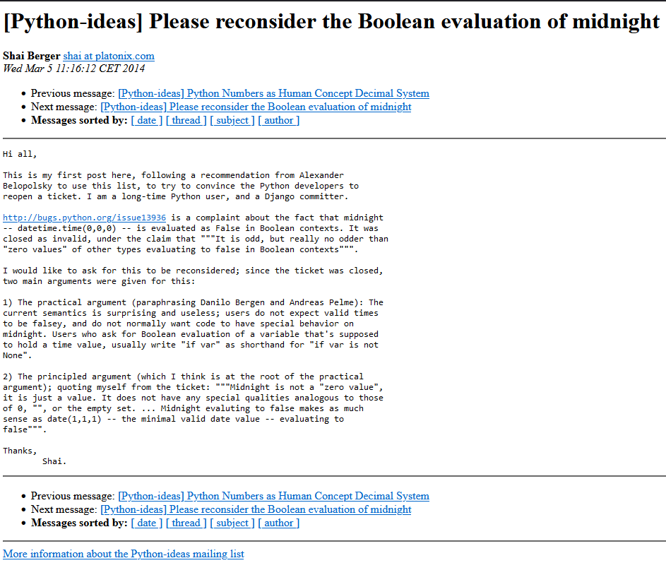

# Conditionals and Flow Control

---

## ``if``

```python
if <expression>:
    <statement>
```

---

```python
if name == "simon":
    pass
```

```python
if age != 28:
    pass
```

---

## ``if``...``elif``...``else``

```python
if <expression>:
    <statement>
elif <expression>:
    <statement>
elif <expression>:
    <statement>
else:
    <statement>
```

---

## ``elif``

```python
def process_event(event):
    if event == "start":
        print("Starting the process...")
    elif event == "run":
        print("Running the process...")
    elif event == "stop":
        print("Stopping the process...")
    else:
        print(f"Unknown event: {event}")
```

https://realpython.com/python-conditional-statements/

---

## ``match``
(Python >= 3.10)


```python
match <expression>:
    case <pattern1>:
        <statement1>
    case <pattern2>:
        <statement2>
    case <patternN>:
        <statementN>
```

---

```python
def process_event(event):
    match event:
        case "start":
            print("Starting the process...")
        case "run":
            print("Running the process...")
        case "stop":
            print("Stopping the process...")
        case _:
            print(f"Unknown event: {event}")
```

---

If we are check if an object is equal to non ``None`` use ``is`` instead

```python
if result is None:
    pass
```

```python
if result is not None:
    pass
```

---

If we are comparing to a boolean value we can omit any comparison operator altogether

```python
if x:
    pass
```

```python
if not x:
    pass
```

---

## "Truthyness" and "Falseyness" in Python

---

"Truthy" Values

|||
|---|---|
|True|``True``|
|Numbers with a non-zero value| e.g ``-1`` ``1`` ``0.1`` |
|Non-Empty Strings|``"a"``|
|Non-Empty Collections|``[1]``, ``{"a":1}``, ``(2)``|

---

```python
# Will print "<x> is truthy" for: -1, "a", [1], etc
if x:
    print(f"{x} is truthy")

```

---

"Falsey" Values

|||
|---|---|
|False|``False``|
|Numbers with a value of 0| e.g ``0``, ``0x0``, ``0O0``, ``0b0`` ``0.0`` |
|Empty Strings|``""``|
|Empty Collections|``[]``, ``{}``, ```()```|
|None||


```python
# Will print "<y> is falsey" for: None, 0, [], "", etc
if not y:
    print("{y} is falsey")
```

---


<a>https://mail.python.org/pipermail/python-ideas/2014-March/026446.html</a>

---

## identity vs equality

---

```

```