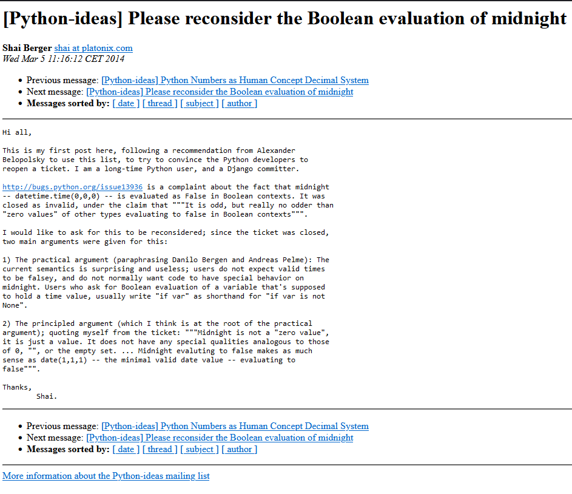

## If statements

Truthyness and Falseyness in python

---

Falsey Values

|||
|---|---|
|False|``False``|
|Numbers with a value of 0| e.g ``0``, ``0x0``, ``0O0``, ``0b0`` ``0.0`` |
|Empty Strings|``""``|
|Empty Collections|``[]``, ``{}``, ```()```|
|None||


---


if x:
    print("x is truthy")

if not y:
    print("y is falsey")

---


</a>https://mail.python.org/pipermail/python-ideas/2014-March/026446.html<a>

---

Truthy Values

|||
|---|---|
|True|``True``|
|Numbers with a non-zero value| e.g ``-1`` ``1`` ``0.1`` |
|Non-Empty Strings|``"a"``|
|Non-Empty Collections|``[1]``, ``{"a":1}``, ``(2)``|


False
None
0


Truthy: `True``

# Loops
## Loops

---

### The ``for`` loop

Iterate over elements in a list

---
```python
fruits = ["apple", "banana", "pear"]

for fruit in fruits:
    print(fruits)
```

---

Iterating over the indexes of a list

```python
fruits = ["apple", "banana", "pear"]

for i in range(len(fruits)):
    print(i, fruits[i])

# 0 apple
# 1 banana
# 2 pear
```

---

A more pythonic way:

If we want both the index AND the value of each item, we can use ``enumerate()``

```python
fruits = ["apple", "banana", "pear"]

for i, v in enumerate(fruits):
    print(i, v)

# 0 apple
# 1 banana
# 2 pear
```

---

Iterating over a dictionary

```python
peoples_ages = { "alice": 23, "bob": 22, "eve": 31 }

for k, v in peoples_ages.items():
    print(k, v)

# alice 23
# bob 22
# eve 31
```

Dictionary order guaranteed since 3.7


## Basics
---
PEP 8 – Style Guide for Python Code

https://peps.python.org/pep-0008/

---
## Spaces vs Tabs

Use 4 spaces per indentation level.


Built In Functions

https://docs.python.org/3/library/functions.html
